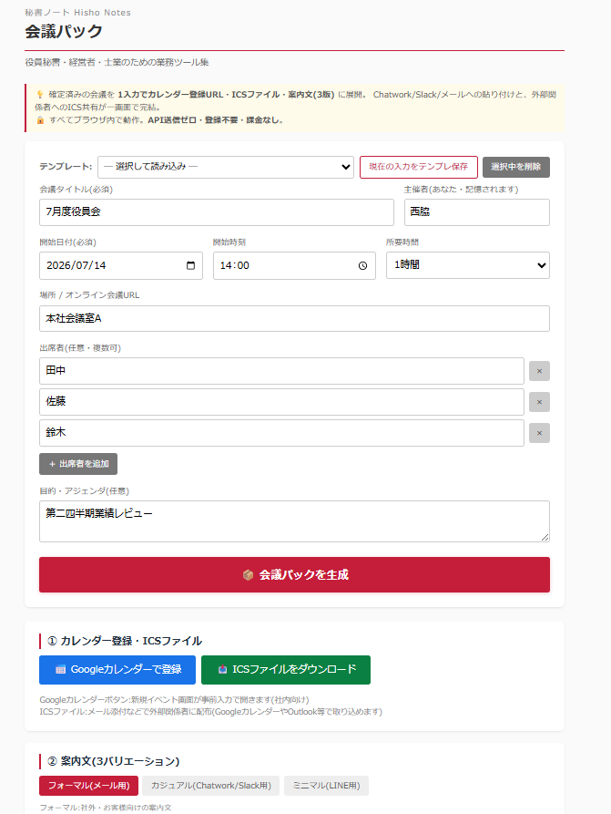

# 秘書ノート / 会議パック

> 役員秘書・経営者・士業のための業務ツール集 — その第3作。

確定済みの会議について、**Googleカレンダー登録URL・ICSファイル・案内文(3形式)** を1入力で一括生成。秘書が同じ情報を複数の場所に書き直す手間を消すブラウザツールです。

**APIキー不要・登録不要・課金なし。** ブラウザで開くだけで動くシングルHTMLです。

---

## デモ

---

## なぜ作ったか

会議を1つセットする時、秘書がやる作業はこんな構成になっています:

| 工程 | 時間 | コピペで解決できる? |
|---|---|---|
| カレンダー登録 | 約2分 | できない(GUI操作) |
| Chatwork案内文 | 約3分 | **できない(文体変換)** |
| メール案内文 | 約3分 | **できない(文体変換)** |
| ICSファイル添付 | 約5分 | **できない(別形式)** |

→ 計13分、**同じ情報を4回書き直してる**のが実態。「コピペすればいい」と言われがちですが、**各届け先の形式が違うため文章のままではコピペできない**のが本当のボトルネックです。

このツールは、1入力から5つのアウトプット(カレンダーURL・ICS・3形式の案内文)を一気に生成して、その「書き直し労働」を消します。

---

## できること

- **1入力 → 5アウトプット**を一括生成
  - 📅 Googleカレンダー登録URL(prefilledで新規イベント画面が開く)
  - 📥 ICSファイルダウンロード(外部関係者にメール添付・どのカレンダーアプリでも取り込み可)
  - 📝 **3バリエーションの案内文**:
    - フォーマル(社外・お客様向けメール用)
    - カジュアル(Chatwork/Slack用、絵文字あり)
    - ミニマル(LINE用、短文)
- **テンプレート保存**:「週次定例」「月次役員会」などをワンクリック呼び出し
- **履歴保存**:過去の会議パックを再生成・流用可
- **主催者名の記憶**:初回入力で次回以降は省略
- **コピーボタン**:案内文を即クリップボードへ → 各チャネルに貼り付け
- **データのエクスポート / インポート**:履歴・テンプレ・主催者名をJSON形式で別PCに移行可能
- **共有PC配慮**:全履歴・全テンプレの一括削除ボタンで退席前にクリア
- **入力ミス防御**:終了時刻が開始より前、開始日時が1年以上過去の場合に警告

---

## 使い方

1. `index.html` をブラウザで開く(ダブルクリックでOK・サーバ不要)
2. 会議タイトル・日時・場所・出席者・目的などを入力
3. 必要なら「テンプレート保存」で再利用可能に
4. **「📦 会議パックを生成」** をクリック
5. 結果から使い分け:
   - 自分のカレンダーへ → 📅 ボタン
   - 外部関係者にメール添付 → 📥 ICSダウンロード
   - 社内チャットへ → カジュアルタブ → コピー
   - 社外メールへ → フォーマルタブ → コピー
   - LINEへ → ミニマルタブ → コピー

→ 1案件あたり**約2分**で5チャネル分の段取りが完了します。

---

## プライバシー・データの扱い

- 本ツールは **完全にブラウザ内で動作**します(サーバ通信ゼロ)
- 入力内容・テンプレート・履歴・主催者名は、お使いの**ブラウザ(localStorage)にのみ保存**されます
- 名前・会議内容を含む全情報は外部に送信しません
- APIキー不要、ログイン不要、課金なし

### 共有PCで使う場合

- 退席前に画面下部「**データ管理**」セクションの「**全履歴を削除**」「**全テンプレを削除**」で消去してください
- もしくはブラウザの**プライベートモード(シークレットウィンドウ)**でのご利用を推奨

### 別のPCに移行する場合

1. 既存PCで「**📤 全データをエクスポート(JSON)**」 → `hisho-meeting-pack-YYYY-MM-DD.json` を取得
2. 移行先PCで本ツールを開き、「**📥 インポート**」 → そのJSONを選択
3. 履歴・テンプレ・主催者名がすべて復元されます

---

## カスタマイズしたい時

シングルHTMLなので、`index.html` をテキストエディタで開いて該当箇所を書き換えるだけです。

| やりたいこと | 書き換え場所 |
|---|---|
| 案内文の文面(フォーマル/カジュアル/ミニマル)を調整 | `renderVariant()` 関数内 |
| 所要時間の選択肢(30分/1時間など)を増減 | `<select id="duration">` の `<option>` |
| 履歴の保存件数(初期50件) | `h.slice(0, 50)` の数値 |
| 過去日警告のしきい値(初期1年) | `generate()` 関数内 `oneYearAgo` の生成箇所 |
| カラーテーマ | CSS の `:root` で `--crimson` 等を変更 |

---

## 免責事項

- 本ツールは **無償で提供されるサンプル実装** です
- Googleカレンダー登録URL・ICSファイルの生成は、ブラウザ内で文字列を組み立てているのみです(外部API不使用)
- 入力内容はブラウザ(localStorage)にのみ保存され、外部送信されません
- ICSファイルは RFC 5545 に概ね準拠していますが、特殊な環境では取り込めない場合があります
- 第三者サービス(Googleカレンダー等)の仕様変更により動作しなくなる可能性があります
- 本ツール利用に起因する一切の損害について、作者は責任を負いません
- 商用利用を含めMITライセンスに準拠します

---

## ライセンス

MIT License — 詳細は [LICENSE](../LICENSE) を参照。

---

## 「秘書ノート」シリーズについて

業務で「これ毎週やってる…自動化できるはず」と思った作業をツール化して順次公開していくシリーズです。役員秘書・経営者・士業の方の **業務効率化と脱属人化** を目的にしています。

- 第1作 [会食お店ピックアップ](../restaurant/) — 店を決める段階
- 第2作 [訪問先カルテ](../visit-prep/) — 相手を調べる段階
- 第3作 **会議パック**(本ツール) — 段取りを配る段階
- 第4作以降 — VIPプロファイル管理、年賀状リスト管理 など

---

## 作者・お問い合わせ

**合同会社AuroraNce / 代表 西脇 あゆみ**(元総合商社役員秘書)

経営者の「右腕」として、中小企業のバックオフィス業務全般を引き受けるBPOを運営しています。秘書・事務・CS・電話代行から、業務自動化ツールの開発・運用までオーダーメイドで対応。

「このツール、うちの業務に合わせて作り変えてほしい」「人手で運用も丸ごと任せたい」といったご相談はお気軽にどうぞ。

- GitHub Issues: 動作不具合の報告はこちらへ
- メール: [info@aurorance.biz](mailto:info@aurorance.biz)
- ウェブサイト: [aurorance.biz](https://aurorance.biz/)
