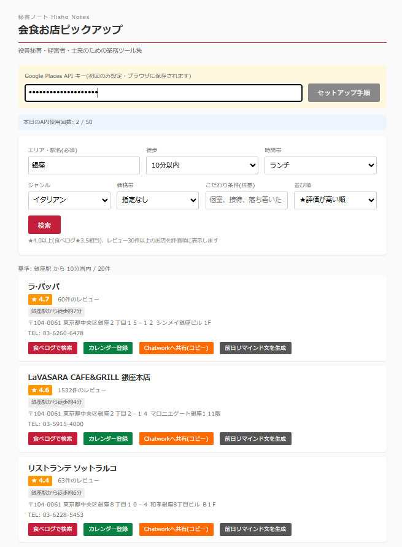
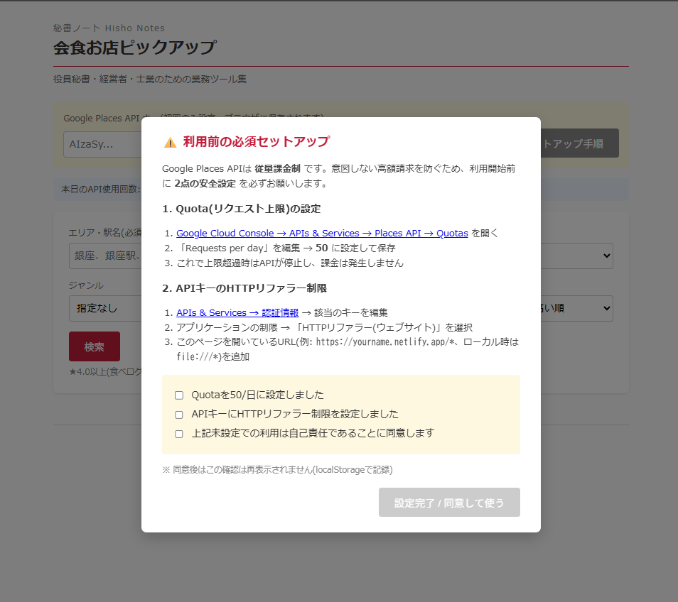
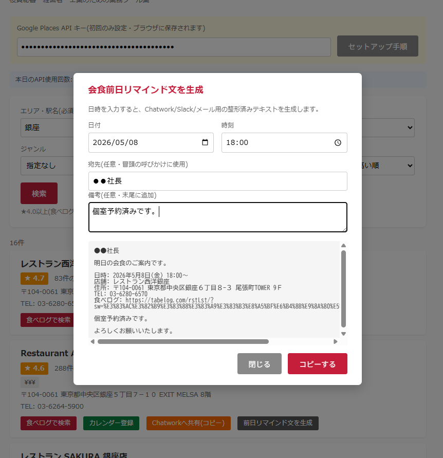

# 秘書ノート / 会食お店ピックアップ

> 役員秘書・経営者・士業のための業務ツール集 — その第1作。

エリアと条件を入れるだけで、Google Places から **★4.0以上(食べログ★3.5相当)・レビュー30件以上** のお店を絞り込み。食べログ検索URL・カレンダー登録・Chatwork共有・前日リマインド文生成までワンクリック。

ブラウザだけで動くシングルHTML、サーバ不要。

---

## デモ

---

## できること

- **エリア×徒歩分数×ジャンル×価格帯** で絞り込み(銀座駅から徒歩5分の寿司、など)
- **★評価とレビュー数で品質フィルタ**(★4.0以上・30件以上の二段)
- **食べログで検索**ボタン:店名+エリアで食べログ検索URLを生成
- **Googleカレンダー登録**:店名・住所・食べログURL等を事前入力
- **Chatwork共有**:整形メッセージをワンクリックでクリップボードへ
- **前日リマインド文生成**:日時を入れると会食前日の案内文を自動整形(コピーしてChatwork/Slack/メールへ)
- **本日のAPI使用回数**を画面上部に表示(課金不安の見える化)

---

## ⚠️ 利用前の必須セットアップ(必ず読んでください)

Google Places API は**従量課金制**です。意図しない高額請求を防ぐため、**以下2点の安全設定を必ず行ってから**使ってください。設定すれば**理論上、課金は発生しません**(無料枠 $200/月の中に収まります)。

> 初回起動時はチェックボックス3つの確認モーダルが表示され、設定確認なしには使えない作りになっています。
>
> 

### 1. APIキーを取得

1. https://console.cloud.google.com/ にログイン(Googleアカウントがあれば誰でも)
2. プロジェクトを新規作成(任意の名前)
3. APIs & Services → Library → **Places API (New)** を有効化
4. APIs & Services → Credentials → APIキーを作成 → コピーしておく

### 2. Quota(リクエスト上限)を 50/日に設定 ★最重要

これが**最強の防御**です。上限を超えるとAPIが**即停止**し、課金は発生しません。

1. https://console.cloud.google.com/apis/api/places.googleapis.com/quotas を開く
2. 「Requests per day」を編集 → **50** に設定して保存

> 50/日 × 30日 = 1,500req/月 ≒ $48 相当 → 無料枠 $200/月 に余裕で収まります。
> もう少し緩めたい場合でも 100〜150/日 までに留めることを強く推奨。

### 3. APIキーに HTTPリファラー制限 を設定

万が一キーが漏洩しても、他人があなたのキーを使えないようにします。

1. https://console.cloud.google.com/apis/credentials → 該当のキーを編集
2. **アプリケーションの制限** → 「HTTPリファラー(ウェブサイト)」を選択
3. 利用するURLを追加:
   - 自分のサイトで公開する場合: `https://yourname.netlify.app/*`
   - ローカルファイルで使う場合: `file:///*`
   - 両方使うなら両方追加

---

## 使い方

1. `index.html` をブラウザで開く(またはNetlify/GitHub Pages等で公開して開く)
2. 初回のみ:**セットアップ確認モーダル**で 3つのチェックボックスを確認 → 「設定完了 / 同意して使う」
3. APIキー欄にキーを貼り付け(初回のみ、ブラウザの localStorage に保存)
4. エリア・条件を選んで「検索」
5. 結果カードの各ボタンを使う

### 各ボタンの挙動

| ボタン | 動作 |
|---|---|
| 食べログで検索 | 店名+エリアで食べログ検索URLを開く(食べログAPIは使用していません) |
| カレンダー登録 | Googleカレンダーの新規イベント画面を事前入力状態で開く |
| Chatworkへ共有(コピー) | 整形メッセージをクリップボードへコピー → Chatworkに貼り付け |
| 前日リマインド文を生成 | 日時を入れると整形済みリマインド文を自動生成、コピーボタンで取得 |

#### 前日リマインド文ジェネレータ

会食前日に送る案内文を、店舗情報+任意の宛先・備考から自動整形します。

---

## カスタマイズしたい時

シングルHTMLなので、`index.html` をテキストエディタで開いて該当箇所を書き換えるだけでOKです。

| やりたいこと | 書き換え場所(行番号目安) |
|---|---|
| Chatwork通知文のフォーマット変更 | `chatworkMsg` の配列 |
| リマインド文のフォーマット変更 | `renderRemind()` 関数内の `lines` 配列 |
| ジャンル選択肢の追加・変更 | `<select id="genre">` の `<option>` |
| 評価フィルタの閾値(★4.0/レビュー30件) | `places.filter(p => (p.rating ...))` の数値 |
| 1日の上限カウンタ表示 | `DAILY_QUOTA_HINT` の数値 |
| 連打防止の冷却時間 | `SEARCH_COOLDOWN_MS` の数値 |

---

## 免責事項

- 本ツールは **無償で提供されるサンプル実装** です。
- 利用にあたり、Google Cloud Console上の **Quota設定** および APIキーの **HTTPリファラー制限設定** は、利用者の責任において必ず実施してください。
- 上記設定を行わずに利用した場合に発生する課金、APIキーの漏洩、その他一切の損害について、**作者は責任を負いません**。
- 本ツールはGoogle社およびその他の第三者と無関係であり、第三者サービスの仕様変更により動作しなくなる可能性があります。
- 食べログ等の検索リンクは URL文字列を組み立てているのみで、各サービスのAPIは利用していません。
- 商用利用を含めMITライセンスに準拠しますが、上記免責は同等に適用されます。

---

## ライセンス

MIT License — 詳細は [../LICENSE](../LICENSE) を参照。

---

## 「秘書ノート」シリーズについて

業務で「これ毎週やってる…自動化できるはず」と思った作業をツール化して順次公開していくシリーズです。役員秘書・経営者・士業の方の **業務効率化と脱属人化** を目的に作っています。

- 第1作: **会食お店ピックアップ**(本ツール)
- 第2作以降: 訪問先の会社情報まとめ、会議3点セット URL ジェネレータ、年賀状リスト管理、VIPプロファイル管理 など

シリーズ全体の入口: [../README.md](../README.md)

---

## 作者・お問い合わせ

業務自動化ツールの内製・カスタマイズ、秘書業務BPO・議事録作成代行・会食手配代行などを承っています。

「このツール、もう少しうちの業務に合わせて作り変えてほしい」「人手で運用も丸ごと任せたい」といったご相談はお気軽にどうぞ。

- 不具合・要望: [GitHub Issues](https://github.com/aurorance-1015/hisho-notes/issues)
- メール: [info@aurorance.biz](mailto:info@aurorance.biz)
- ウェブサイト: [aurorance.biz](https://aurorance.biz/)
