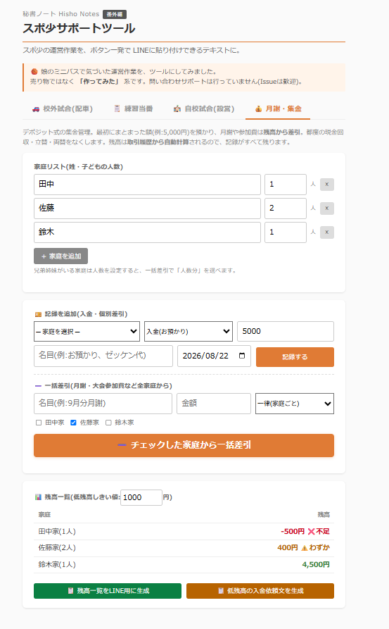

# 秘書ノート 番外編 / スポ少サポートツール

> 「秘書ノート」(役員秘書・経営者・士業のための業務ツール集)の **番外編**。
> スポ少の運営作業を、ボタン一発で LINEに貼り付けできるテキストに。

---

## これ何?

娘のミニバスで気づいたことがあります。

**スポ少の代表って、時間がある人がやる**。でも本当は、時間がない人ほどツールが必要。仕組み化する暇があれば最初から仕組み化してる。だから手作業がずっと残る。

そこに「ボタン一発で結果が出てくる」ツールを置いてみました。売り物ではなく、作ってみた系です(笑)

スポ少の「場面」ごとに、4つのタブが入っています。

| タブ | 場面 |
|---|---|
| 🚗 **校外試合(配車)** | 他校・遠征での試合。集合案内 + 配車割(引率) |
| 📋 **練習当番** | 普段の練習。月間の当番を公平ローテ |
| 🏫 **自校試合(設営)** | 自校開催。開催案内 + 会場設営など役割分担 |
| 💰 **月謝・集金** | デポジット式の集金管理。都度の現金回収・立替・両替をなくす |

---

## デモ

---

## できること

### 🚗 校外試合(配車)

他校での試合・遠征など、車で移動する日。

- **集合案内 + 配車割を1枚で生成** ─ 試合名・集合日時・集合場所・会場・備考を入れると、案内文と配車表がまとまって出力
- **参加する子と、車を出せる家(席数)を入力 → 自動で配車割**
- **姓マッチング** ─ ドライバーの姓と一致する子は、その家の車に優先で乗る(田中さんちの太郎くんは田中車へ)
- 入力内容の自動保存、席不足アラート

### 📋 練習当番

毎週の練習当番を、月間まとめて公平ローテ。

- **期間 + 練習曜日を指定 → 1ヶ月分の当番表を一気に生成**(お休みは除外)
- 保護者全員から、**担当回数が少ない人を自動で優先**、連続当番も避けて分散
- **試合の日は「🏀 ○○カップ ※出欠・詳細は別途」の予告として表示**(当番割り振りはしない)
- **担当回数を累計で記録** ─ 誰が何回やったか一目で分かる(棒グラフ表示)、シーズンを通じて公平

### 🏫 自校試合(設営)

自校開催の試合・大会など、多くの保護者が集まって会場設営する日。

- **開催案内 + 役割分担を1枚で生成** ─ 試合名・会場・集合時間・備考 + 役割分担
- 役割ごとに必要人数を設定(体育館・トイレ・ミーティングルーム・駐車場 など、初期値入り)
- **希望を考慮して割り振り**(「田中:体育館」と書けば体育館へ優先配置)
- **「常駐」役割**(会場に留まる必要がある役目)は、常駐NGの人を避ける
- 余った人は「サポート(手が空いた方)」として明示、担当回数も累計で記録

### 💰 月謝・集金

デポジット式の集金管理。「最初にまとまった額を預かって、月謝や参加費はそこから引く」だけで、都度の現金回収・未持参の立替・おつりの両替がなくなります。

- **家庭リスト**(姓 + 子どもの人数)を登録
- **入金を記録**(例:5,000円お預かり)、**個別差引**も同じフォームで
- **一括差引** ─ 名目(9月分月謝 など)+金額で全家庭から一斉に。**「一律 / 人数分(子ども数×金額)」**を選べるので兄弟姉妹の家庭にも対応
- **残高は取引履歴から自動計算** ─ 残高を手で書き換えないので合わなくなる事故がない。「いつ・何で・いくら」が全部残る
- 低残高は ⚠️、マイナス(立替発生)は ❌ で一覧に表示
- **LINE共有テキスト2種** ─ 残高一覧(月初にグループへ)/ 低残高家庭への入金依頼文
- 間違えた記録は履歴から × で取消(残高も再計算)

どのタブも結果は **LINEに貼り付けられるテキスト**。コピーして団のグループに流すだけです。

---

## 使い方

1. `index.html` をブラウザで開く(ダブルクリックでOK、サーバ不要)
2. 上部のタブで場面を選ぶ(🚗 校外試合 / 📋 練習当番 / 🏫 自校試合 / 💰 月謝・集金)
3. 情報を入力して生成ボタン
4. 出力テキストを「コピーする」→ LINEに貼り付け

当番系のタブで「履歴に記録」を押すと担当回数が累計され、次回の割り振りで公平性の基準として使われます。
💰 月謝・集金は、入金・差引を記録するたびに残高が自動で更新されます(月初に「残高一覧をLINE用に生成」→ グループに貼る運用がおすすめ)。

---

## プライバシー・データの扱い

- 本ツールは **完全にブラウザ内で動作**(サーバ通信ゼロ)
- 入力内容・担当回数の累計・集金の取引履歴は **localStorage** に保存(あなたのブラウザにだけ)
- 名前や金額を含む全データは外部に送信しません
- APIキー不要、ログイン不要、課金なし
- 共有PCで使う場合は、各タブの「累計をリセット」「家庭の削除」で消せます
- 💰 月謝・集金のデータはブラウザのキャッシュ削除で消えます。**大事な残高情報なので、月1回「残高一覧」をLINE用に生成して控えとして残しておく**ことをおすすめします

---

## ⚠️ ゼロサポート前提です

本ツールは **問い合わせ対応を行っていません**。売り物ではなく「作ってみた」だからです。

- ❌ メール・DMでの使い方相談
- ❌ 個別カスタマイズの依頼
- ❌ 不具合修正の確約
- ✅ **GitHub Issues** での報告は歓迎(対応するかは気分次第)
- ✅ MITライセンスなのでフォークして勝手に改造OK

「うちの団でこういう機能が欲しい」のご要望は、**Issues に投げてもらえれば次バージョンに反映するかも**しれません。

---

## このシリーズ、続きます

番外編、月1ペースで機能追加していく予定です。

| Ver | 内容 | リリース |
|---|---|---|
| v1.0 | **配車割**(校外試合の配車) | 公開済み |
| v1.1 | **練習当番 + 自校試合(設営)** を追加、3タブ構成に | 公開済み |
| v1.2 | **月謝・集金(デポジット管理)** を追加、4タブ構成に。立替・両替地獄をなくす | 公開済み |
| v1.3 | **固定休管理** | 2026/9 末 |
| v1.4 | **部員管理**(歴代名簿で役員交代しても記録が残る) | 2026/10 末 |

→ それぞれ「現場で気づいた構造の理不尽」を1つずつ消していく作り。

---

## 「秘書ノート」本編について

本編は役員秘書・経営者・士業のための業務ツール集です:

- 第1作 [会食お店ピックアップ](../restaurant/)
- 第2作 [訪問先カルテ](../visit-prep/)
- 第3作 [会議パック](../meeting-pack/)
- 第4作 [VIPプロファイル管理](../vip-profile/) ★旗艦
- 以降、月1ペースで継続中

シリーズ全体: [秘書ノート リポジトリ](https://github.com/aurorance-1015/hisho-notes)

---

## 免責事項

- 本ツールは **無償で提供される個人プロジェクト**です
- 割り振りの結果は機械的な計算です。実運用では人間の目で最終確認をお願いします
- 入力内容はブラウザ内(localStorage)にのみ保存、外部送信なし
- 本ツール利用に起因する一切の損害について作者は責任を負いません
- MITライセンスに準拠

---

## ライセンス

MIT License — 詳細は [LICENSE](../LICENSE) を参照。

---

## 作者

**合同会社AuroraNce / 西脇 あゆみ**

普段は中小企業のバックオフィスBPO・業務自動化ツール開発を生業にしています。番外編はその合間に、自分の生活で「これ作りたいな」と思ったものを置いていく場所です。

🌐 [aurorance.biz](https://aurorance.biz/)
📩 info@aurorance.biz(**本業案件**のご相談はこちらへ / 番外編のご質問は Issues 推奨)
