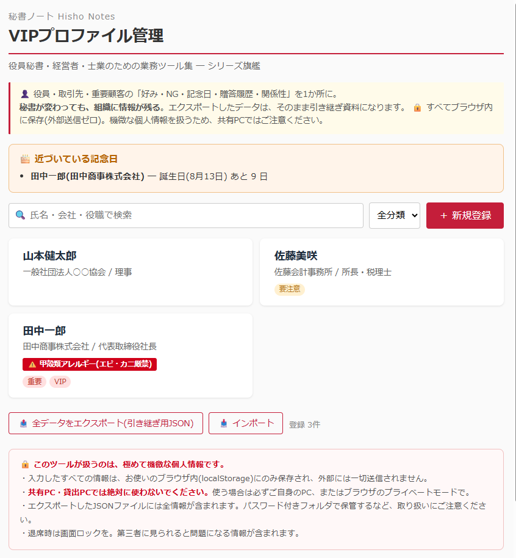

# 秘書ノート / VIPプロファイル管理

> 役員秘書・経営者・士業のための業務ツール集 — その第4作にして、シリーズの旗艦。

役員・取引先・重要顧客の「好み・NG・記念日・贈答履歴・関係性」を1か所に集約。**秘書の頭の中にしかない情報を、組織に残る形にする**ツールです。

**APIキー不要・登録不要・課金なし。** ブラウザで開くだけで動くシングルHTMLです。

---

## デモ



---

## なぜ作ったか ─ シリーズの原点

秘書業務の最大の問題は、**重要な情報が「秘書の頭の中」にしかない**ことです。

- ●●社長は甲殻類アレルギー
- ××会長との付き合いは先代からで、紹介者は△△氏
- ◇◇様には毎年お歳暮で日本酒(辛口)、去年は喜ばれた
- □□部長には家族の話題を振らない

これらは、会食の手配ミスや贈答の失敗を防ぐ、実務の生命線です。ところが名簿にも顧客管理システムにも載っていない。**秘書が辞めた瞬間、全部消える**。引き継ぎ書3枚では絶対に伝わらない。

「秘書ノート」シリーズは、この属人化を1つずつ形式知に変えるプロジェクトです。会食の店選び(vol.1)、訪問前の下調べ(vol.2)、会議の段取り(vol.3)ときて、本作はその中核 ─ **人にまつわる暗黙知そのもの**を構造化します。

---

## できること

- **VIPプロファイルの登録・編集・削除** ─ 7ブロックの構造化スキーマ
  - 基本情報(氏名・会社・役職・分類・連絡先)
  - **好み・NG**(好物・アレルギー・タブー)
  - **関係性**(出会いのきっかけ・経緯・紹介者・決裁権)
  - 記念日(誕生日・創立記念日・お中元お歳暮の要否)
  - **贈答・接待履歴**(日付・品目・金額帯・反応を時系列で)
  - 自由メモ・タグ
- **⚠️ アレルギー・NGの強調表示** ─ 一覧で赤バッジ、詳細で赤枠。会食手配の事故を防ぐ
- **記念日リマインド** ─ 30日以内に誕生日が来る人を画面上部に表示
- **検索・絞り込み** ─ 氏名・会社・役職で検索、分類・タグでフィルタ
- **JSONエクスポート / インポート** ─ **引き継ぎの核**。前任から後任へ、ファイル1つで全情報を渡せる
- **印刷** ─ 1人分のプロファイルシートをA4で出力

---

## 「出会いのきっかけ」と「紹介者」について

地味に見えて、実は関係性の力学を記録する重要項目です。

「この方は●●会長のご紹介」という情報が残っていれば、**その人に対応する時は紹介者の顔も立てる**という判断ができます。紹介の連鎖(●●会長 → 佐藤社長 → 鈴木部長)は、ベテラン秘書が頭の中に持っている見えない地図。それを記録に残せるようにしました。

---

## 使い方

1. `index.html` をブラウザで開く(ダブルクリックでOK・サーバ不要)
2. **「＋ 新規登録」**からプロファイルを作成
3. 一覧のカードをクリックすると詳細表示(印刷もここから)
4. 引き継ぎ時は **「📤 全データをエクスポート」** → 後任がインポート

### 引き継ぎの流れ

```
前任秘書:「📤 全データをエクスポート」→ JSONファイルを取得
   ↓ (安全な方法で受け渡し)
後任秘書:本ツールを開いて「📥 インポート」→ 全プロファイル復元
```

紙の引き継ぎ書では伝えきれない「人の情報」が、ファイル1つで引き継げます。

---

## 🔒 プライバシー ─ 必ずお読みください

**本ツールが扱うのは、極めて機微な個人情報です。**

- 入力したすべての情報は、お使いの**ブラウザ内(localStorage)にのみ保存**されます。サーバへの送信は一切ありません
- **共有PC・貸出PCでは絶対に使わないでください**。使う場合は必ずご自身のPCで
- エクスポートしたJSONファイルには全情報が含まれます。**パスワード付きの場所で保管**し、受け渡しにも注意してください
- 退席時は画面ロックを。第三者に見られると問題になる情報が含まれます
- ブラウザのキャッシュクリア(サイトデータ削除)でデータが消えます。**定期的なエクスポートをバックアップとして推奨**します

---

## カスタマイズしたい時

シングルHTMLなので、`index.html` をテキストエディタで開いて該当箇所を書き換えるだけです。

| やりたいこと | 書き換え場所 |
|---|---|
| 分類の選択肢(取引先/役員/顧客/来賓)を変更 | `<select id="f-category">` と一覧のフィルタ |
| 記念日リマインドの日数(初期30日) | `renderReminders()` 内の `days <= 30` |
| タグの色分けルール | `tagClass()` 関数 |
| カラーテーマ | CSS の `:root` で `--crimson` 等を変更 |

---

## 免責事項

- 本ツールは **無償で提供されるサンプル実装** です
- 入力内容はブラウザ(localStorage)にのみ保存され、外部送信されません
- ブラウザのデータ削除等による情報消失について、作者は責任を負いません(エクスポートによるバックアップを推奨します)
- 本ツール利用に起因する一切の損害について、作者は責任を負いません
- 商用利用を含めMITライセンスに準拠します

---

## ライセンス

MIT License — 詳細は [LICENSE](../LICENSE) を参照。

---

## 「秘書ノート」シリーズについて

業務で「これ毎週やってる…自動化できるはず」と思った作業をツール化して順次公開していくシリーズです。役員秘書・経営者・士業の方の **業務効率化と脱属人化** を目的にしています。

- 第1作 [会食お店ピックアップ](../restaurant/) — 店を決める
- 第2作 [訪問先カルテ](../visit-prep/) — 相手を調べる
- 第3作 [会議パック](../meeting-pack/) — 段取りを配る
- 第4作 **VIPプロファイル管理**(本ツール) — 人の情報を組織に残す ★旗艦
- 番外編 [スポ少サポートツール](../spo-tool/)

---

## 作者・お問い合わせ

**合同会社AuroraNce / 代表 西脇 あゆみ**(元総合商社役員秘書)

経営者の「右腕」として、中小企業のバックオフィス業務全般を引き受けるBPOを運営しています。秘書・事務・CS・電話代行から、業務自動化ツールの開発・運用までオーダーメイドで対応。

**このツールでエクスポートしたデータは、そのまま秘書業務BPOへの引き継ぎ資料としても使えます。**「秘書が退職するので業務ごと外部に任せたい」といったご相談もお気軽にどうぞ。

- GitHub Issues: 動作不具合の報告はこちらへ
- メール: [info@aurorance.biz](mailto:info@aurorance.biz)
- ウェブサイト: [aurorance.biz](https://aurorance.biz/)
