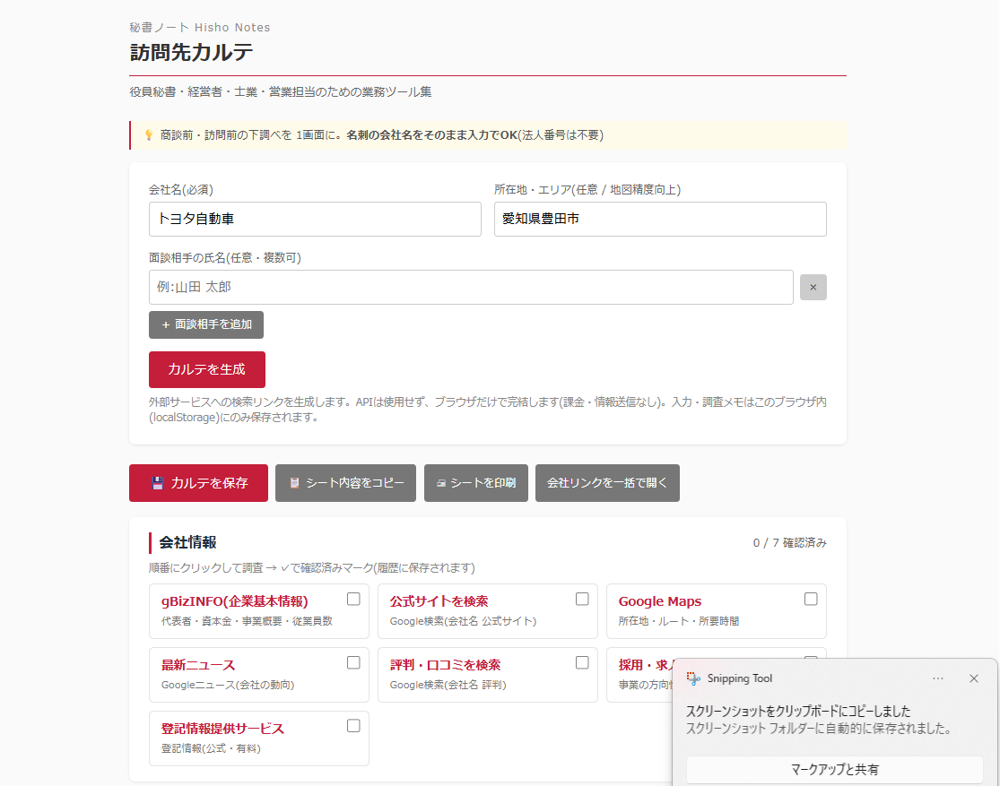

# 秘書ノート / 訪問先カルテ

> 役員秘書・経営者・士業のための業務ツール集 ― その第2作。

会社名を入れるだけで、訪問先・商談相手の調査に必要なリンクを1画面に集約。面談相手の氏名を入れれば人物情報の検索リンクも生成。調べた内容はそのまま**印刷できるブリーフィングシート**に書き込めて、履歴として蓄積されます。

**APIキー不要・登録不要・課金なし。** ブラウザで開くだけで動くシングルHTMLです。

---

## デモ

---

## できること

- **会社情報リンクを一括生成**(7種)
  - gBizINFO(代表者・資本金・事業概要・従業員数)/ 公式サイト検索 / Google Maps / 最新ニュース / 評判・口コミ / 採用・求人情報 / 登記情報提供サービス
- **人物情報リンクを生成**(面談相手の氏名入力時・6種)
  - Google検索 / LinkedIn / Facebook / X(Twitter)/ Wantedly / ニュース・登壇
- **印刷できるブリーフィングシート**
  - 会社概要・面談相手・商談メモを画面上で直接入力 → A4印刷
  - 入力した会社名・所在地・面談相手は自動で反映
- **調査メモの履歴保存**
  - 「カルテを保存」で調べた内容ごと記録。次回同じ会社を開くと前回の調査メモが復元される
  - 誰が調べても会社カルテが蓄積される(脱属人化)
- **会社リンクを一括で開く**(ポップアップ許可時)

---

## 使い方

1. `index.html` をブラウザで開く(ダブルクリックでOK。サーバ不要)
2. **会社名**を入力(必須)、**所在地**(任意)を入力
3. 面談相手がいれば「＋ 面談相手を追加」で**氏名**を入力(任意・複数可)
4. **「カルテを生成」**をクリック
5. 生成された各リンクをクリックして情報収集
6. 調べた内容を**ブリーフィングシートに直接入力**
7. **「💾 カルテを保存」**で履歴に保存、または**「🖨 シートを印刷」**で持参用に印刷

> 次回、同じ会社を履歴からクリックすると、前回入力した調査メモがそのまま復元されます。

---

## プライバシー・データの扱い

- 本ツールは**外部サービスへの検索リンクを生成するだけ**で、APIや個人情報の外部送信は一切行いません。
- 入力内容・調査メモ・履歴は、お使いの**ブラウザ内(localStorage)にのみ保存**されます。サーバには送信されません。
- 共有PCで使う場合は、履歴に会社名・調査メモが残る点にご注意ください(各項目の「削除」で消せます)。

---

## カスタマイズしたい時

シングルHTMLなので、`index.html` をテキストエディタで開いて該当箇所を書き換えるだけです。

| やりたいこと | 書き換え場所 |
|---|---|
| 会社情報リンクの追加・変更 | `companyLinks()` 関数内の配列 |
| 人物情報リンクの追加・変更 | `personLinks()` 関数内の配列 |
| ブリーフィングシートの項目変更 | `
` 内の `data-key` 付きフィールド |
| 履歴の保存件数(初期50件) | `h.slice(0, 50)` の数値 |

---

## 免責事項

- 本ツールは **無償で提供されるサンプル実装** です。
- 外部サービスへの検索リンクを生成するのみで、APIや個人情報の外部送信は行いません。
- 入力内容・調査メモ・履歴は、お使いのブラウザ(localStorage)にのみ保存されます。
- リンク先サービスの内容・仕様・利用条件については、各サービスの規約に従ってください。
- 第三者サービスの仕様変更によりリンクが動作しなくなる可能性があります。
- 本ツール利用に起因する一切の損害について、作者は責任を負いません。
- 商用利用を含めMITライセンスに準拠します。

---

## ライセンス

MIT License ― 詳細は [LICENSE](../LICENSE) を参照。

---

## 「秘書ノート」シリーズについて

業務で「これ毎週やってる…自動化できるはず」と思った作業をツール化して順次公開していくシリーズです。役員秘書・経営者・士業の方の **業務効率化と脱属人化** を目的にしています。

- 第1作: [会食お店ピックアップ](../restaurant/)
- 第2作: **訪問先カルテ**(本ツール)
- 第3作以降: 会議パック、VIPプロファイル管理、年賀状リスト管理 など

---

## 作者・お問い合わせ

**合同会社AuroraNce / 代表 西脇 あゆみ**(元総合商社役員秘書)

経営者の「右腕」として、中小企業のバックオフィス業務全般を引き受けるBPOを運営しています。秘書・事務・CS・電話代行、業務自動化ツールの開発・運用まで、オーダーメイドで対応。

「このツール、うちの業務に合わせて作り変えてほしい」「人手で運用も丸ごと任せたい」といったご相談はお気軽にどうぞ。

- GitHub Issues: 動作不具合の報告はこちらへ
- メール: [info@aurorance.biz](mailto:info@aurorance.biz)
- ウェブサイト: [aurorance.biz](https://aurorance.biz/)
